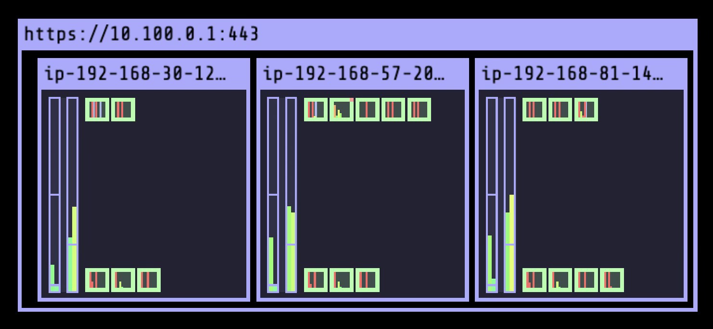
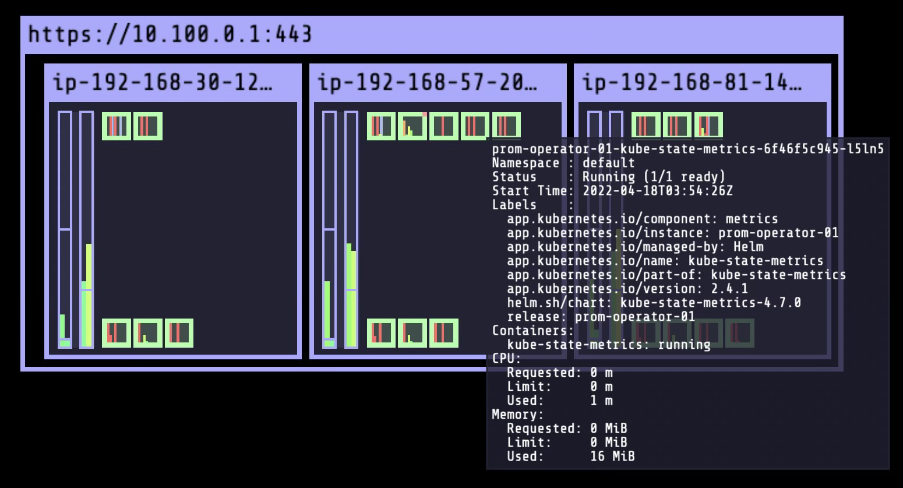
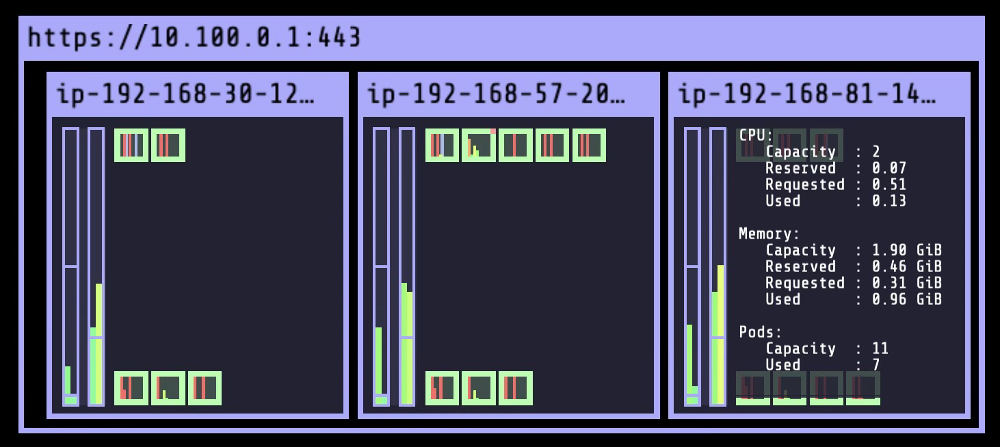

# Horizontal Pod Autoscaling on EKS

## Table of Contents

- [Overview](#overview)
- [Setting up kube-ops-view](#setting-up-kube-ops-view)
- [Creating an HPA](#creating-an-hpa)
- [Scale a sample application](#scale-a-sample-application)

## Overview

Kubernetes clusters must scale to handle fluctuating demand. Instead of doing this manually, you can create automated processes which save time, allow quick response during peak demand times, and conserve costs by scaling down when resources are not being used. One way to automate management is through horizontal pod autoscaling. 

The **Horizontal Pod Autoscaler (HPA)** is controlled by the Kubernetes controller manager which assesses the use of resources repeatedly after a certain interval of time; the default value for this interval is 15 seconds and is denoted by the flag `--horizontal-pod-autoscaler-sync`. The autoscaler compares the metrics utilized by the deployment to the metrics defined for each HPA to determine resizing. These resources include:

- *Resource metrics*: these can be a target utilization value of a fixed target.
- *Custom metrics*: these can be defined by the use for each HPA.
- *Object metrics and external metrics*: these are based on a single metric taken from the object. This is compared to a target value to produce a utilization ratio.

In this guide, you will set up `kube-ops-view` to visualize the autoscaling being performed on your EKS cluster and deploy an HPA. Finally, you will generate load using a sample app to trigger the HPA to adjust number of pods in your cluster. 

## Setting up `kube-ops-view`

> To complete this step, you should have [`Helm`](https://helm.sh/) installed. 

The following code installs `kube-ops-view`. This installation uses a LoadBalancer service to install kube-ops-view and creates a resource based access control (RBAC) entry to read information on the cluster. 

```console
helm install kube-ops-view \
stable/kube-ops-view \
--set service.type=LoadBalancer
--set rbac.create=True
```

After installation, check if the chart was installed properly using the following:

```console
helm list
```

The result should be similar to this:

```console
NAME            REVISION        UPDATED                         STATUS          CHART                   APP VERSION     NAMESPACE
kube-ops-view   1               Web Feb 22 09:13:27 2023        DEPLOYED        kube-ops-view-23.2.0    4.3             default  
```

Now that kube-ops-view is installed, let's visualize our cluster. The following code generates a URL. Open the URL to view a visual representation of your EKS cluster.

```console
kubectl get svc kube-ops-view | tail -n 1 | awk '{ print "Kube-ops-view URL = http://"$4 }'
```

The display should look similar to this: 



Hover over some of the components in the view to uncover more information about the cluster:





Throughout the rest of this guide, refer to this visual to view the changes made to the deployment by the HPA resource. 

## Creating an HPA

Before setting autoscaling into action, we must install Kubernetes Metrics Server. This is a service which provides container resource metrics which drive the autoscaling of your deployment. You can find more information on Metrics Server [here](https://github.com/kubernetes-sigs/metrics-server/).

```console
kubectl apply -f https://github.com/kubernetes-sigs/metrics-server/releases/latest/download/components.yaml
```

To check if installation was successful, run the following command:

```console
kubectl get apiservice v1beta1.metrics.k8s.io -o json | jq '.status'
```

The result should be in JSON format. If all checks are passed and no component is flagged, we can continue. 

## Scale a sample application

In this step, we will deploy a sample application on TCP port 90 and expose it as a Service. The sample application used here performs calculations to generate load. More information on the application can be found [here](https://kubernetes.io/docs/tasks/run-application/horizontal-pod-autoscale-walkthrough/#run-expose-php-apache-server).

```console
kubectl create deployment sample-app --image=us.gcr.io/k8s-artifacts-prod/hpa-example
kubectl set resources deploy sample-app --requests=cpu=200m
kubectl expose deploy sample-app --port 90
kubectl get pod -l app=sample-app
```

We will now create the HPA resource using this following command. This HPA scale when CPU exceeds 60% of its resource allocation. `min` and `max` denote the lower and upper limits of pods set by the autoscaler respectively. 

```console
kubectl autoscale deployment sample-app \
    --cpu-percent=60 \
    --min=1 \
    --max=5
```

After creating the HPS resource, use the following command to view autoscaling metrics. *Note*: this process may take a few minutes to load. 

```console
kubectl get hpa
```

Your output should look similar to this:

```console
NAME         REFERENCE                     TARGET    MINPODS   MAXPODS   REPLICAS   AGE
sample-app   Deployment/sample-app/scale   0% / 60%  1         5         1          13s
```

We have now created an HPA and can view autoscaling metrics. Now, we will generate load on our sample application to trigger autoscaling.

Open a new terminal and run the following command. You will start a different pod which will act as a Client, constantly sending queries to http://sample-app Service.

```console
kubectl run -i --tty load-generator --rm --image=busybox /bin/sh -c "while sleep 0.01; do wg1et -q -O- http://sample-app; done"
```

In your previous terminal, open the following command to view how CPU load is changing:

```console
kubectl get hpa sample-app -w
```

The CPU utilization metric should be changing. Observe how autoscaling affects how the deployment is resized. After 1-3 minutes, the CPU utilization will look similar to this:

```console
NAME         REFERENCE                     TARGET      MINPODS   MAXPODS   REPLICAS   AGE
sample-app   Deployment/sample-app/scale   165% / 60%  1         5         1          3m
```

After a few more minutes, more replicas will form. Your output may look similar to this:

```console
NAME         REFERENCE                     TARGET      MINPODS   MAXPODS   REPLICAS   AGE
sample-app   Deployment/sample-app/scale   165% / 60%  1         5         3          7m
```

Once you've examined how autoscaling works terminate load generation by typing `<Ctrl> + C` in the terminal where you started load generation. After 1-3 minutes, verify that autoscaling resized the deployment using the following command:

```console
kubectl get hpa sample-app -w
```

```console
NAME         REFERENCE                     TARGET       MINPODS   MAXPODS   REPLICAS   AGE
sample-app   Deployment/sample-app/scale   0% / 60%     1         10        1          11m
```

You should notice the HPA automatically scaled down the number of replicas to 1 once CPU utilization reduced to 0. You have now successfully used horizontal pod autoscaling with a sample application.

